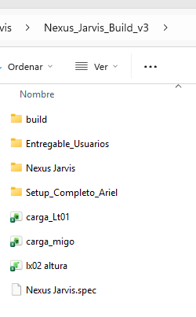

# Implementación de Distribución Nexus Jarvis

## Objetivo
Crear una distribución simplificada para usuarios finales y una completa para administración, asegurando que la interfaz coincida exactamente con la solicitud visual del usuario.

## Cambios en UI (`logistic_suite.py`)
Renombrar botones para coincidir con el screenshot:
- "Carga MIGO" -> "Transferencia MIGO"
- "Pallet Altura (LX02)" -> "Auditor de Altura"
- "Transporte (VT11)" -> "Auditor de Transporte"
- "Visión Pizarra (IA)" -> "Vision IA: Panel de operación"
- "Auditor Stock" -> "Auditor de tránsitos pendientes"
- "Traspaso LT01" -> "Transferencias Lt01"
- "Conversiones UMV" -> (Mantener visible pero al final, o confirmar si se oculta. Por defecto lo mantendremos).

## Creación de Plantillas (Excel)
Analizaremos los bots para crear plantillas `.xlsx` mínimas viables:
1. `Plantilla_MIGO.xlsx` (Para `Tx_MIGO3.py`)
2. `Plantilla_LT01.xlsx` (Para `Bot_Traspaso_LT01.py`)
3. `Plantilla_Pallet.xlsx` (Para `Bot_Pallet.py` - aunque suele pegar datos, a veces requiere un Excel base).
4. `Plantilla_Conversiones.xlsx` (Para `Bot_Conversiones_UMV.py`).

## Script de Empaquetado (`package_distribution.py`)
Logica actualizada:
- **Admin**: Copia todo (`Nexus Jarvis.exe`, `fire.json`, scripts, `start_manager.bat`).
- **Usuario**: 
    - Copia `Nexus Jarvis.exe`.
    - Copia `_internal`.
    - Copia `settings.json` (limpio).
    - **EXCLUYE** `fire.json`.
    - **EXCLUYE** `start_manager.bat`.
    - **INCLUYE** carpeta `Plantillas/`.

## Verificación
- Ejecutar script de empaquetado.
- Verificar contenidos de carpetas de salida.
